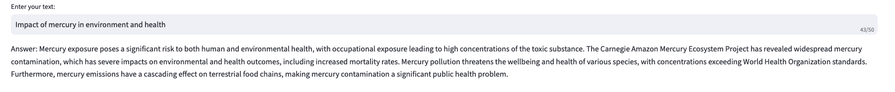

## Downstream Tasks applied to the ASGM-KG

<div style="text-align: justify">

### Query and Answer (QnA):
For querying the knowledge graph we are using the Neo4J database to store the graph and query it. There are 4 types of queries we performed on the knowledge graph and resultant figures have been shown below.

**Query1:** This type of query consists only of the Subject (as source node) and returns all the relations associated with Entity2 (as destination node) directed by the source node. For example, the following sample query returns the result where mercury acts as the source node and all the other nodes are directed, shown at Figure `Query 1`.

```
MATCH (n) -[r]-> (m)
WHERE n.name = $source_node
RETURN n.name as subject, TYPE(r) as predicate, m.name as object
```
**Query2:** This type of query consists only of the Entity2 (as destination node) and returns all the relations associated with Subject (as source node) directed to the destination node. For example, the following sample query returns the result where amazon acts as the destination node and all the other nodes are directed to it, shown at Figure `Query 2`.
```
MATCH (n) -[r]-> (m)
WHERE m.name = $dest_node
RETURN n.name as subject, TYPE(r) as predicate, m.name as object
```

**Query3:** This type of query consists only of a particular relation and returns the Subject (as source node) and Entity2 (as destination node) associated with the relation, shown in Figure `Query 3`.
```
MATCH (n) -[r]-> (m)
WHERE TYPE(r) = $relation
RETURN n.name as subject, TYPE(r) as predicate, m.name as object
```

**Query4:** This type of query consists of the Subject (as source node) and Entity2 (as destination node) and returns all the relations associated with these nodes which are shown in Figure `Query 4`.
```
MATCH (n) -[r]-> (m)
WHERE n.name = $source_node AND m.name = $dest_node  
RETURN n.name as subject, TYPE(r) as predicate, m.name as object
```

| | |
|-|-|
| |  |
|Query 1: Selecting Source Node (mercury)|Query 2: Selecting Destination Node (amazon)|
| | |
|Query 3: Selecting Relation (related_to)|Query 4: Selecting Source Node (mercury) and Destination Node (amazon)|


### Summary of the Graph
We are adopting two approaches to summarize a subgraph of the entire ASGM-KG. Our first approach involves K-hop distance mapping from selecting a source node. In this approach, we are taking the K value ranging from 1 to 5 and summarizing each subgraph based on the entities found in each k-hop distance. In the following table (generated for demonstration purpose), we showed only K=1, 3, and 5 with their respective path findings and summary, which works as the proof of the concept for summarizing the graph using K-hop distance. As expected, the larger K value incorporates more paths that lead from the source node, hence the summary becomes more meaningful and informative.

For the second approach, we are taking any two entities that the user might be interested in and summarizing the graph based on the path that has been found during the traversal of the graph from source to destination entity, which has been shown at the last row of the table below.

| **Type of Summary**                                | **K-hop Distance** | **Path-Findings**                                                                                                                                                                                                                                                                                                                                                                                                                                                                                                                                                                                                                                                                                                                                                                                                                                                                                                                                         | **Summary**                                                                                                                                                                                                                                                                                                                                                                                                                                                                                                                                                                                                                                                                                                                                                                                                                                                                                                                                                                                                                                                                                                                                                                                                                                                                                                                        |
|----------------------------------------------------|--------------------|-----------------------------------------------------------------------------------------------------------------------------------------------------------------------------------------------------------------------------------------------------------------------------------------------------------------------------------------------------------------------------------------------------------------------------------------------------------------------------------------------------------------------------------------------------------------------------------------------------------------------------------------------------------------------------------------------------------------------------------------------------------------------------------------------------------------------------------------------------------------------------------------------------------------------------------------------------------------|--------------------------------------------------------------------------------------------------------------------------------------------------------------------------------------------------------------------------------------------------------------------------------------------------------------------------------------------------------------------------------------------------------------------------------------------------------------------------------------------------------------------------------------------------------------------------------------------------------------------------------------------------------------------------------------------------------------------------------------------------------------------------------------------------------------------------------------------------------------------------------------------------------------------------------------------------------------------------------------------------------------------------------------------------------------------------------------------------------------------------------------------------------------------------------------------------------------------------------------------------------------------------------|
| **Starting from Mercury {Source Node Only}**       | 1                  | mercury is a natural element, mercury found in Amazonian soils, mining activities use mercury, mercury found in environments, mercury released in air, human exposure is to mercury, mercury released into water bodies, mercury released into rivers, mercury released into soil, mercury is considered a persistent contaminant (... ...)                                                                                                                                                                                                                                                                                                                                                                                                                                                                                                                           | Mercury, a natural element, is used extensively in various industries such as mining, oil, and petrochemicals. It is particularly prevalent in the Amazon region, where it is used in artisanal and informal gold mining. The process requires mercury to amalgamate and recover gold. However, this leads to mercury being released into the environment - the air, soil, and water systems. It is also dumped on land and in water bodies. Mercury emissions also occur from mercury-rich soils and biomass burning. Once released, mercury cannot be destroyed and is considered a persistent contaminant (... ...)                                                                                                                    |
|                                  **Starting from Mercury {Source Node Only}**                    | 3                  | mercury is a natural element, mercury found in Amazonian soils, mining activities use mercury, mercury found in environments, mercury released in air, human exposure is to mercury, (... ...), mercury found in Latin America, Mercury poses risks, Mercury impacts quality of life, Mercury impacts health, mercury must be regulated, Minamata Convention identification management sites, 'Minamata Convention restricted mercury exports (... ...)'                                                                                                                                                                                                                                                                                                                                                                                             | Mercury, a natural element, is a significant problem due to its emission into the environment, particularly in the air, soils, and water bodies. This emission primarily occurs through human activities, notably artisanal and small-scale gold mining (ASGM) in regions like the Amazon and Latin America. In these activities, miners use mercury to amalgamate gold from soils, resulting in the release of mercury vapors when the mercury-gold amalgam is heated. This process contributes to the contamination of the environment, including water systems and the food chain, as mercury can transform into bioavailable forms like methylmercury, which bioaccumulates in living organisms such as fish. Human exposure to mercury, primarily through the consumption of contaminated fish, poses health risks. Despite regulations and the Minamata Convention aiming to manage and restrict mercury emissions, illegal activities and smuggling continue to fuel mercury use and contamination. (... ...) |
|                                          **Starting from Mercury {Source Node Only}**            | 5                  | mercury is a natural element, mercury found in Amazonian soils, mining activities use mercury, mercury found in environments, mercury released in air, human exposure is to mercury, (... ...), mercury found in Latin America, Mercury poses risks, Mercury impacts quality of life, Mercury impacts health, mercury must be regulated, Minamata Convention identification management sites, 'Minamata Convention restricted mercury exports (... ...) Risks poison wildlife, wildlife threatens endemic species, alluvial sediments removed by dredges and mini dredges, studies concern mercury bioaccumulation', 'mercury bioaccumulation alter Amazonian ecosystems', 'studies show higher concentrations mercury', 'higher concentrations mercury found in water fish (... ...)' | The problem of mercury contamination is significant in the Amazon region, particularly in Colombia and Peru. This contamination is largely due to illegal gold mining activities that use mercury in the extraction process. The mercury is released into the air, soil, and water systems, posing serious risks to human health and the environment. Colombia, which does not produce mercury, relies on imports, with Mexico being a main provider. The mercury used in these mining activities is often smuggled into the country, sometimes hidden in other shipments. The contamination affects not only the miners but also the local communities, who are exposed to mercury through skin contact, inhalation of vapors, and ingestion of contaminated food and water. The mercury also enters the food chain, bioaccumulating in fish, which are a major part of the diet of these communities. Despite the risks and the international regulations such as the Minamata Convention, which aims to manage and reduce mercury emissions, the illegal trade and use of mercury continue, driven by the high demand due to the gold mining boom. Efforts to monitor and research the situation are ongoing, but are often hindered by limited capacity and discrepancies in data. The situation calls for urgent and coordinated action to protect the vulnerable populations and the rich biodiversity of the Amazon region. |
| **Mercury {Source Node} to Amazon {Target Node}** | N/A                | 'mercury contaminates fish', 'fish are in the Amazon'                                                                                                                                                                                                                                                                                                                                                                                                                                                                                                                                                                                                                                                                                                                                                                                                                                                                                                            | Mercury contaminates fish that are in the Amazon.                                     |


---


### Chat with the Graph

In this downstream task, user can have a chat with the Graph itself, and the program will return the response based on the data within the Graph. For this task, we use Llama model as Chat Agent which process the response given by the user. We first take the response from the user and create a sentence embedding vector out of it. Then we calculate the similarity of this embedding vector with our previously calculated word embedding vector based on the dataset we used in the paper and then retrieve the similar context based on their similarity.

Following image shows the response of the chat agent given by the user -


**We are still working on the enhancement of this chat feature like including chat history and feedback based on the previous response.**

</div>
