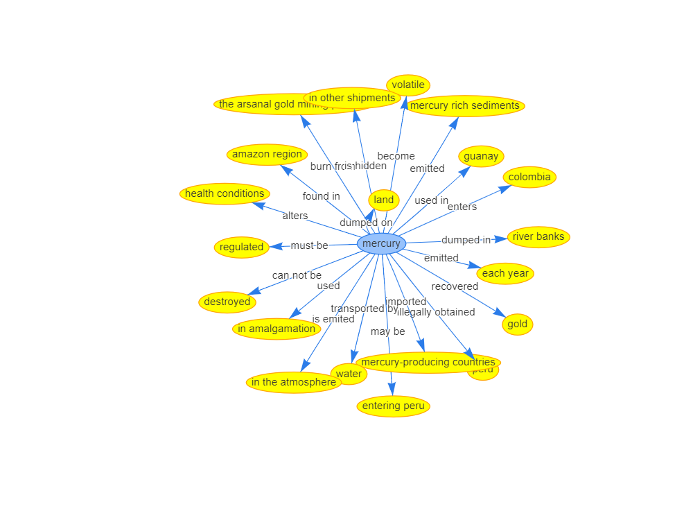
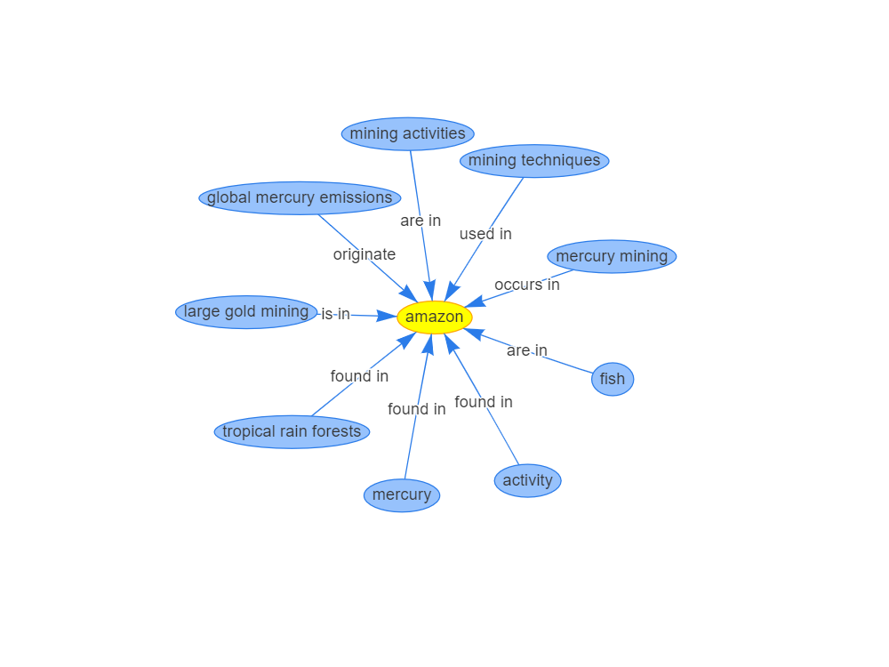
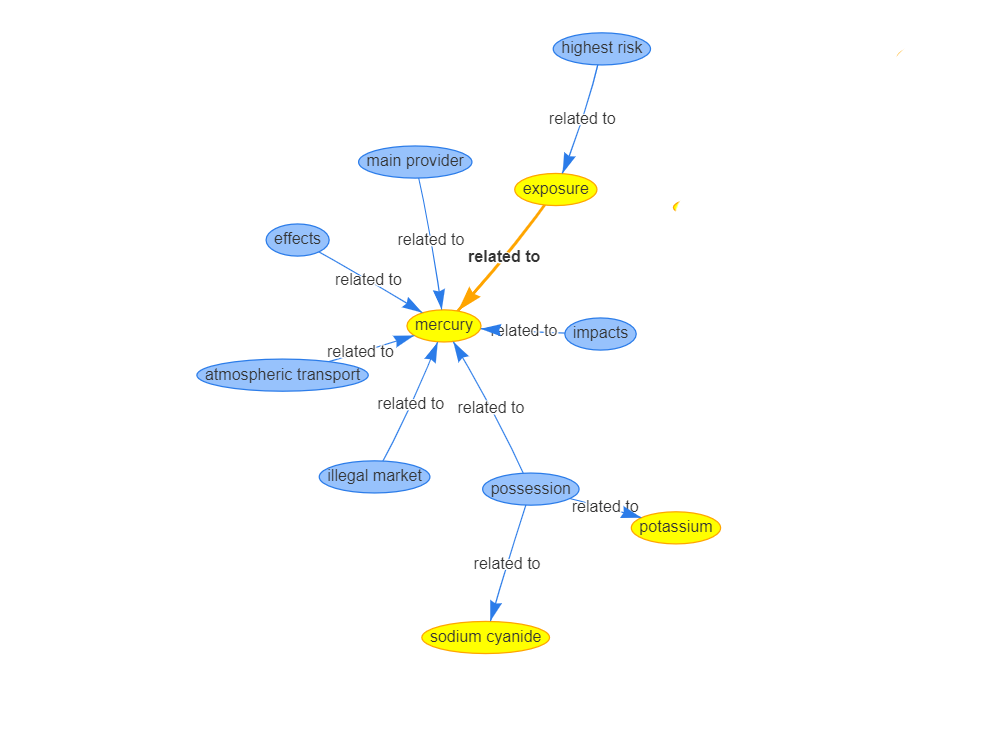
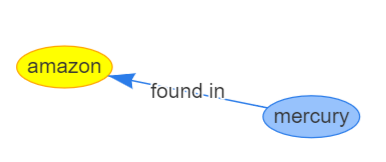

## Downstream Tasks applied to the ASGM-KG

### Query and Answer (QnA):
For querying the knowledge graph we are using the Neo4J database to store the graph and query it. There are 5 types of queries we performed on the knowledge graph and resultant figures have been shown at Figure `kg_query`.

**Query1:** This type of query consists only of the Subject (as source node) and returns all the relations associated with Entity2 (as destination node) directed by the source node. For example, the following sample query returns the result where mercury acts as the source node and all the other nodes are directed, shown at Figure `kg_query(a)`.

```
MATCH (n) -[r]-> (m)
WHERE n.name = $source_node
RETURN n.name as subject, TYPE(r) as predicate, m.name as object
```
**Query2:** This type of query consists only of the Entity2 (as destination node) and returns all the relations associated with Subject (as source node) directed to the destination node. For example, the following sample query returns the result where amazon acts as the destination node and all the other nodes are directed to it, shown at Figure `kg_query(b)`.
```
MATCH (n) -[r]-> (m)
WHERE m.name = $dest_node
RETURN n.name as subject, TYPE(r) as predicate, m.name as object
```

**Query3:** This type of query consists only of a particular relation and returns the Subject (as source node) and Entity2 (as destination node) associated with the relation, shown in Figure `kg_query(c)`.
```
MATCH (n) -[r]-> (m)
WHERE TYPE(r) = $relation
RETURN n.name as subject, TYPE(r) as predicate, m.name as object
```

**Query4:** This type of query consists of the Subject (as source node) and Entity2 (as destination node) and returns all the relations associated with these nodes which are shown in Figure `kg_query(d)`.
```
MATCH (n) -[r]-> (m)
WHERE n.name = $source_node AND m.name = $dest_node  
RETURN n.name as subject, TYPE(r) as predicate, m.name as object
```

| | |
|-|-|
| |  |
|Query 1: Selecting Source Node (mercury)|Query 2: Selecting Destination Node (amazon)|
| | |
|Query 3: Selecting Relation (related_to)|Query 4: Selecting Source Node (mercury) and Destination Node (amazon)|